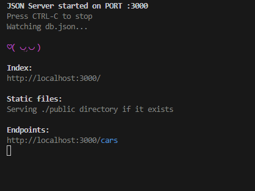
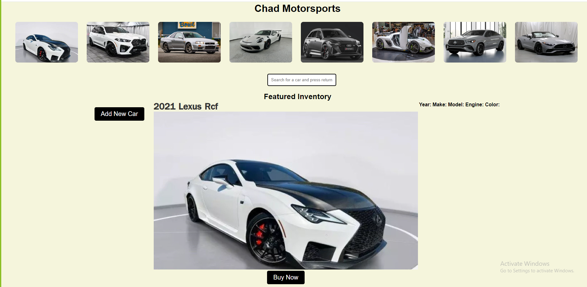

Looking for a Luxury/Sports car of your Dream?

Look no further! Here at Chad Motorsports we offer a variety of cars that could YOU can possible go away with today.

Things we used to get the page working

 Application Startup

* Open terminal in Visual Studio Code and make sure your http://localhost:3000 isn't running on anything else 
* Still in terminal open up the directory to which your project is being created
* Type json-server --watch db.json and run that 
* It worked if you see something like the following

 

* Run explorer.exe index.html for windows 
* Run open index.html for MAC
* You Should see the following:

 

Webpage Features

* Search

Our search feature allows users to find specific vehicles they are interested in within the Featured Inventory. Users can also type in a single letter, and relevant results will automatically appear. 

* Add New Car

Our add new car function allows the owner to add a new vehicle that has hit the lot by inputting the year, make, model of the car, and image.

* Buy Now

We also offer an online buying platform that, when you press "BUY NOW," displays a screen of confetti to congratulate you on your new purchase.

Credits 

* This project was created by Kevin Fajardo, Casey Rayson, and Kaleb Malone.
* We applied the skills we learned from Flatiron, along with some additional research, to create a functional webpage.
* We used Google Images for the car images, a link for the confetti effect, and the rest of the styling was our own creative work.

